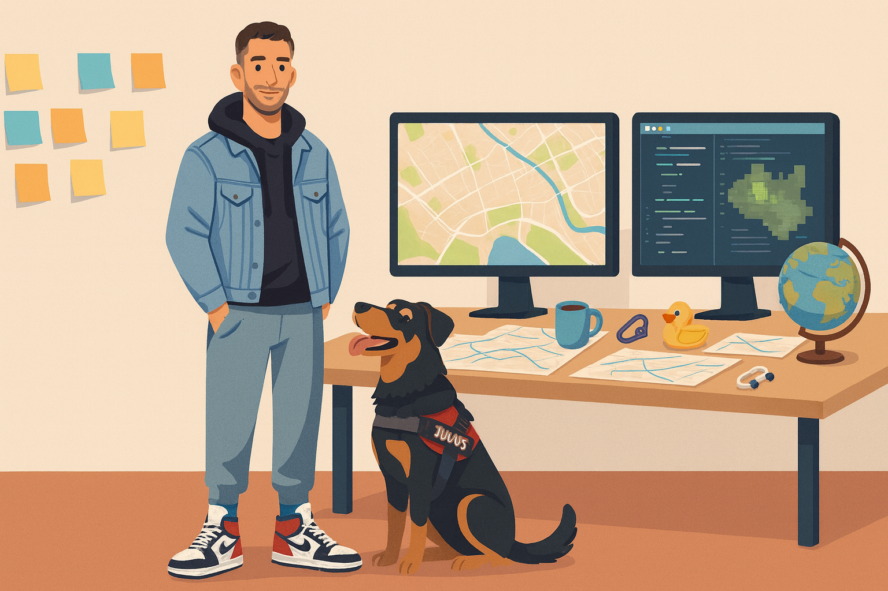

# Hi there, I'm Javi 👋

Environmental and transport engineer focused on mobility, road safety, and data-driven territorial planning.

I have advanced skills in GIS and spatial analysis, which I use to understand territorial dynamics, evaluate the impacts of mobility projects, and support data-driven decision-making. I am particularly interested in projects that enhance sustainability, safety, and resilience while making everyday travel simpler and more humane.

In this profile you can find tools, scripts and examples related to GIS, mobility analysis, and data-driven planning — from QGIS workflows to Python experiments.

---

## 🧭 What I work on

- Sustainable urban and mobility planning  
- Road safety and traffic management  
- Public space and street design  
- Data-driven analysis and decision support for public authorities  

---

## 🌱 I’m currently learning ...

- Sharpening my Python skills for data analysis and automation  
- Developing QGIS workflows, scripts and plugins to streamline everyday tasks  
- Improving my software practices: cleaner code, documentation and reproducible analyses  

---

## 💬 Ask me about ...

- QGIS workflows, spatial analysis and automation  
- Map design and cartography for reports and presentations  
- Mobility, road safety and accessibility analysis  
- Sustainable urban planning and transport strategies  

---

## 🧗‍♂️ Beyond work

Outside of work, I enjoy rock climbing and the outdoors. That mix of strategy, commitment, decision-making and planning has strongly influenced how I approach projects and problem-solving.

---

## 📫 Get in touch

- 💼 LinkedIn: [Javier Hernández Piris](https://www.linkedin.com/in/javierhpiris)  
 
If you’re working on projects related to sustainable mobility, road safety, GIS or spatial analysis, feel free to reach out — I’m always open to exchanging ideas and learning from other practitioners.
